<h1 align="center">Hi 👋, I'm Frontend Developer</h1>
<h3 align="center">Greetings! This portfolio is a reflection of my love for web development and my dedication to honing my craft. Uncover my skill set, from responsive layouts to dynamic website, and discover how I blend technical expertise with a touch of artistry to create engaging online experiences.</h3>

### Table of Contents

- [Agency](#Agency-Neo-News)
- [TargetMe](#TargetMe)
- [Collaborate with other projects web](#Collaborate-with-other-projects-web)

## Agency Neo News
### Overview

<!-- TODO: Add a screenshot of the live project.
    1. Link to a 'live demo.'
    2. Describe your overall experience in a couple of sentences.
    3. List a few specific technical things that you learned or improved on.
    4. Share any other tips or guidance for others attempting this or something similar.
 -->

 <!-- 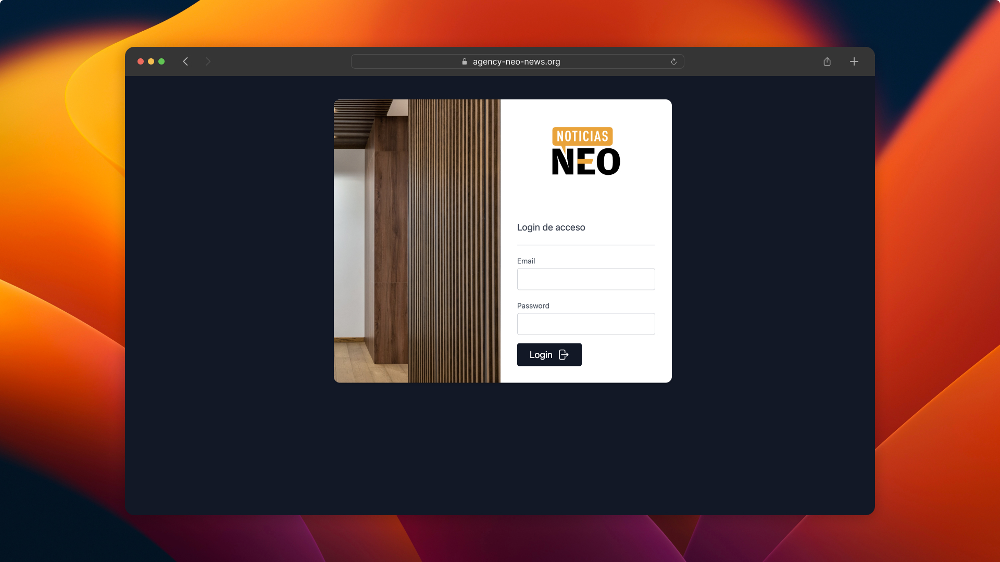 -->

 
 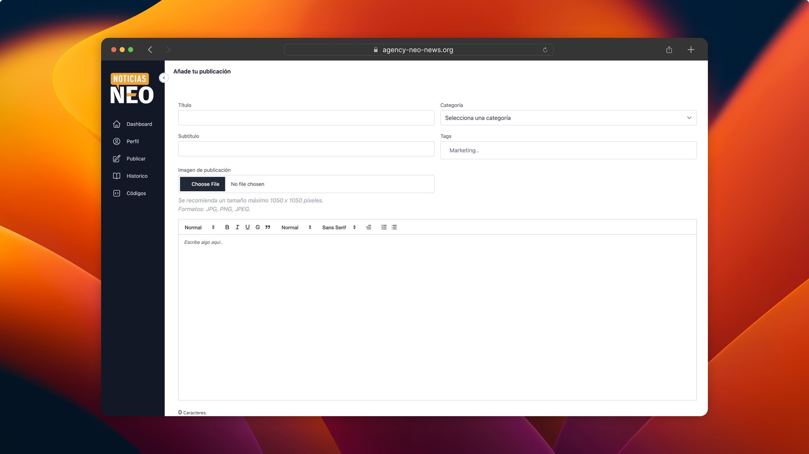
 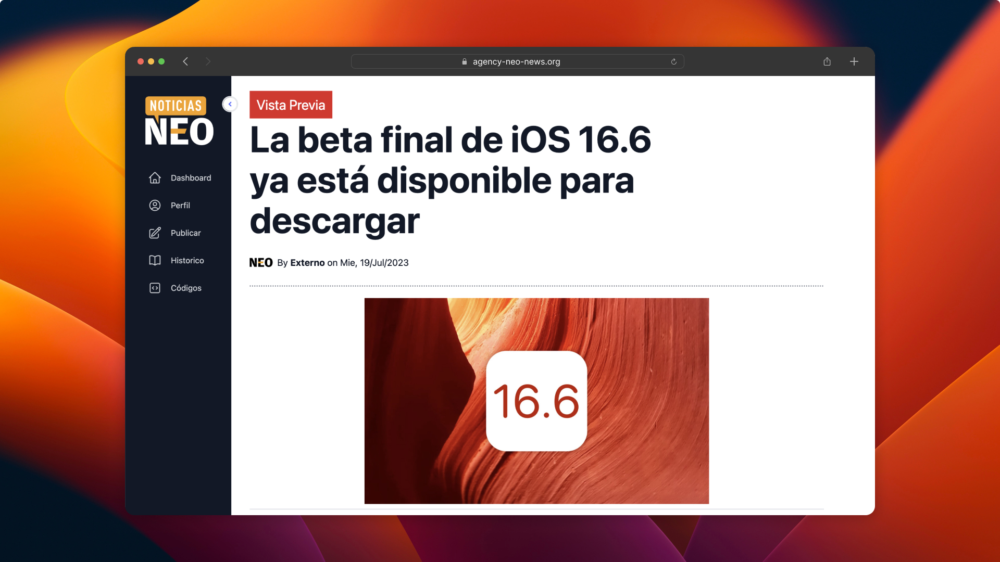
 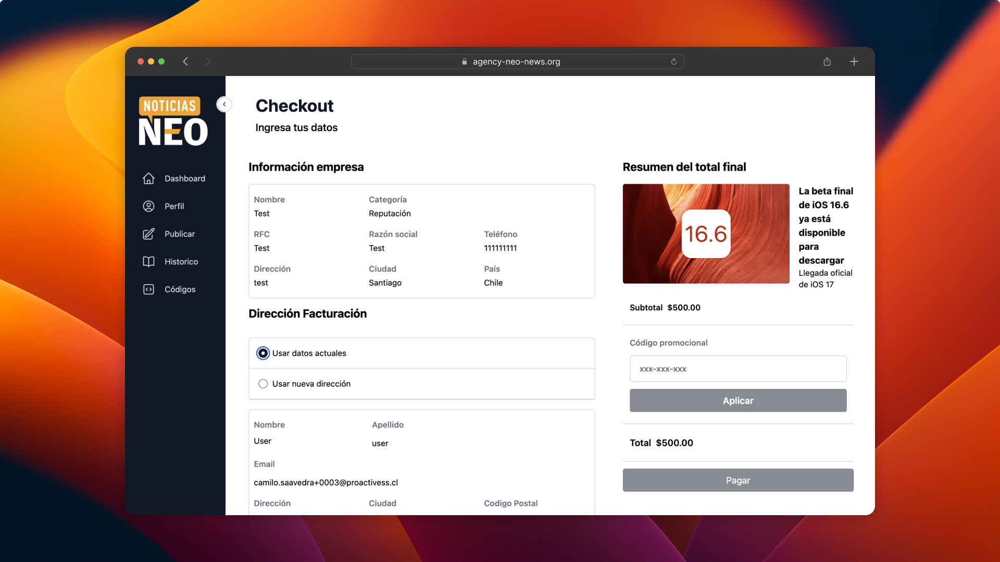

 Welcome to the Publication Management Platform, a comprehensive solution addressing the challenges of subscription management for magazine publications. The platform caters to three distinct user levels:

1. End-Users: Representing companies, end-users can effortlessly create, manage, and monitor their publications. They have access to a user-friendly dashboard, enabling them to publish, save, and track the status of their publications.

2. Editors: With access to submissions, editors can review and publish content. They possess the authority to manage posts, monitor statuses, and update the final publication status.

3. Administrators: Administrators wield full control, creating representative users for companies, enabling editors, and overseeing the entire platform. They can create users of all levels, including representatives, editors, and new administrators.

### Built With

<!-- TODO: List any MAJOR libraries/frameworks (e.g. React, Tailwind) with links to their homepages. -->
This platform is developed using a robust tech stack, combining the power of modern technologies:

* React JS
* Tailwind CSS
* Node JS
* Express JS
* MYSQL
* Amazon Simple Storage
* DigitalOcean solutions. 

### Features

<!-- TODO: List what specific 'user problems' that this application solves. -->
The Publication Management Platform offers a range of essential features to streamline the publication process, including:

* User-friendly dashboard for companies to create, manage, and monitor publications.
* Efficient content submission and review process for editors.
* Comprehensive administration tools for user management and publication oversight.

### Acknowledgements

<!-- TODO: List any blog posts, tutorials or plugins that you may have used to complete the project. Only list those that had a significant impact. Obviously, we all 'Google' stuff while working on our things, but maybe something in particular stood out as a 'major contributor' to your skill set for this project. -->

During the development of this platform, I drew insights from various resources, contributing significantly to its successful implementation:

* [React documentation](https://es.react.dev)
* [Tailwind CSS documentation](https://tailwindcss.com) 
* [Node JS documentation](https://nodejs.org/en/docs)
* [Express JS documentation](https://expressjs.com)
* [MYSQL documentation](https://dev.mysql.com/doc/)

These resources played a vital role in enriching my skill set and enabling me to deliver a robust and efficient publication management platform.

<h3 align="left">Languages and Tools:</h3>

         

## TargetMe
### Overview

<!-- TODO: Add a screenshot of the live project.
    1. Link to a 'live demo.'
    2. Describe your overall experience in a couple of sentences.
    3. List a few specific technical things that you learned or improved on.
    4. Share any other tips or guidance for others attempting this or something similar.
 -->

 
 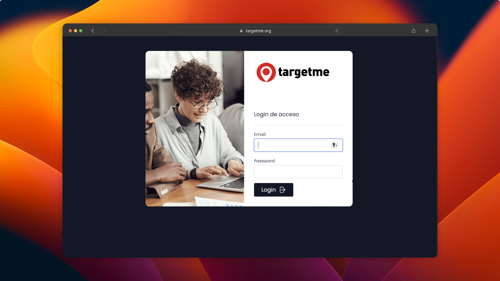
 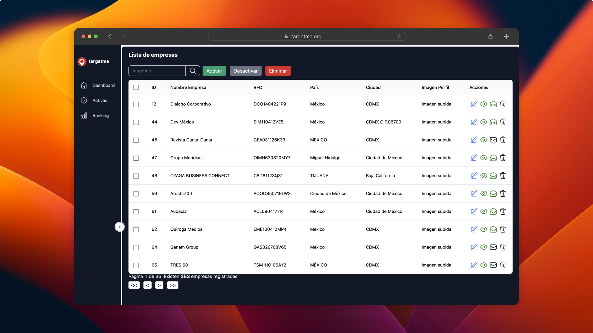
 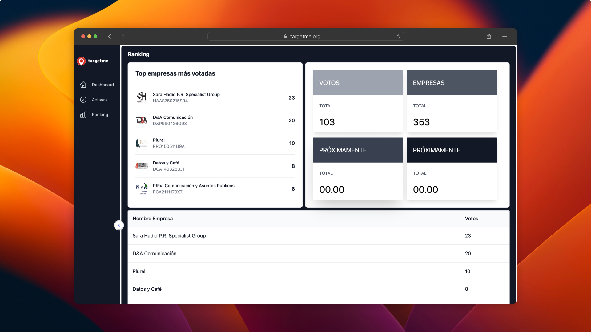

Welcome to TargetMe, a cutting-edge digital platform designed to measure the satisfaction levels of marketing services through monitoring and polling. Our mission is to provide the marketing industry with an agnostic and reliable perspective, driven by automated perception votes. This evaluation is sourced directly from clients, suppliers, and fans of participating agencies and companies, making it the first survey and Quality Monitoring initiative in Mexico.

Website [TargetMe](https://www.targetme.org/)

### Built With

<!-- TODO: List any MAJOR libraries/frameworks (e.g. React, Tailwind) with links to their homepages. -->
This platform is developed using a robust tech stack, combining the power of modern technologies:

* React JS
* Tailwind CSS
* Node JS
* Express JS
* MYSQL
* Amazon Simple Storage
* DigitalOcean solutions. 

### Features

<!-- TODO: List what specific 'user problems' that this application solves. -->
TargetMe offers a range of features to facilitate the evaluation process and enhance marketing services satisfaction:

* Agency Registration: Agencies and companies can register to participate in the platform's evaluation process.
* Administrator Dashboard: The administrator manages agency pre-admission, activates participation, and edits information through a dedicated dashboard.
* External Access Tokens: Agencies can generate access tokens for representatives to edit profiles and information.
* Interactive Profiles: Each agency has a user-friendly profile, allowing clients, suppliers, or fans to view information and cast votes.
* Voting System: Users can cast three votes, each for different agencies or companies, under the "DIRECTORY" section.
Enhanced Satisfaction: Clients, suppliers, and fans can vote or promote votes to boost the satisfaction levels of agencies.

### Acknowledgements

<!-- TODO: List any blog posts, tutorials or plugins that you may have used to complete the project. Only list those that had a significant impact. Obviously, we all 'Google' stuff while working on our things, but maybe something in particular stood out as a 'major contributor' to your skill set for this project. -->

During the development of this platform, I drew insights from various resources, contributing significantly to its successful implementation:

* [React documentation](https://es.react.dev)
* [Tailwind CSS documentation](https://tailwindcss.com) 
* [Node JS documentation](https://nodejs.org/en/docs)
* [Express JS documentation](https://expressjs.com)
* [MYSQL documentation](https://dev.mysql.com/doc/)

These resources played a vital role in enriching my skill set and enabling me to deliver a robust and efficient publication management platform.

<h3 align="left">Languages and Tools:</h3>

         

## Collaborate with other projects web

### World Marketing Summit Español
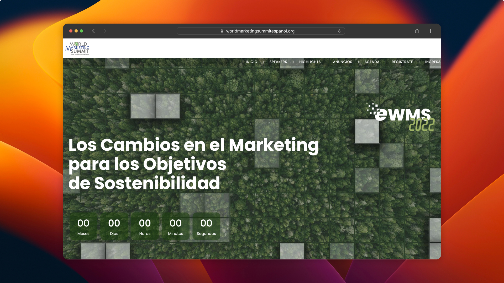

Website: [World Marketing Summit Español](https://www.worldmarketingsummitespanol.org)

### Neo Comunicaciones
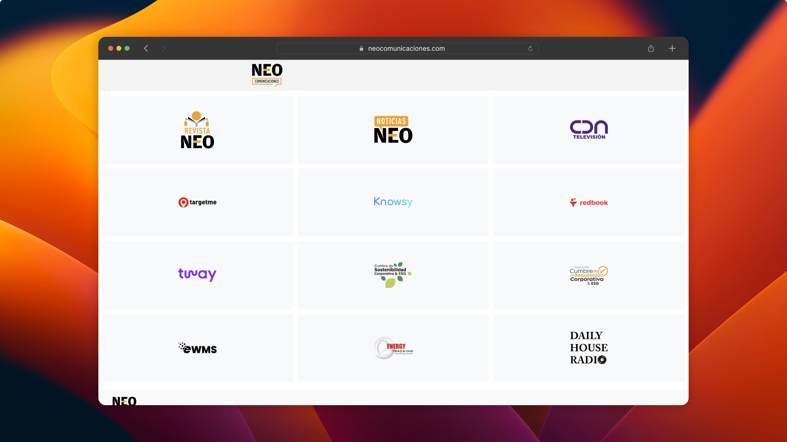

Website: [Neo Comunicaciones](https://www.neocomunicaciones.com)

### CUMBRE DE REPUTACIÓN CORPORATIVA LATAM 2022
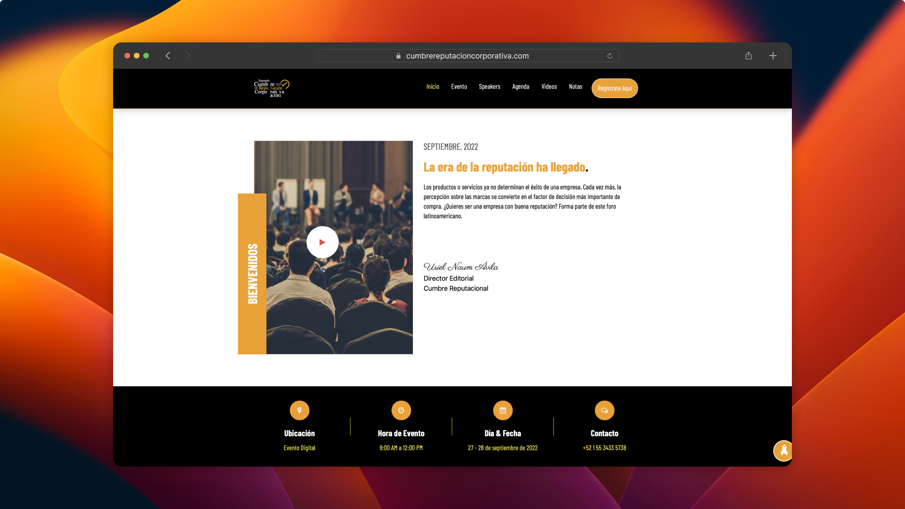

Website: [Cumbre reputacional](https://www.cumbrereputacioncorporativa.com)

### Redbook México
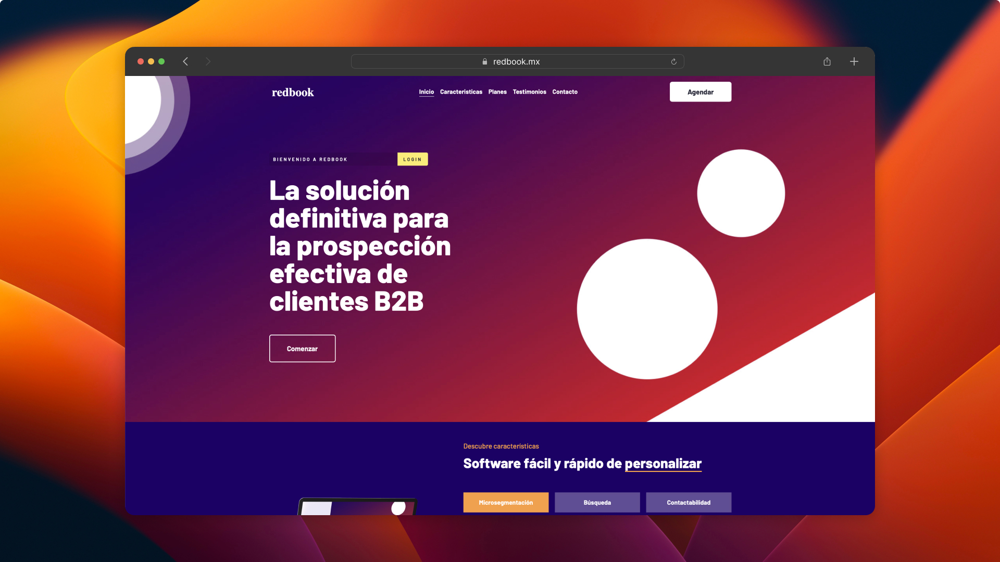

Website: [Redbook MX](https://www.redbook.mx)

### Alaska Transportes
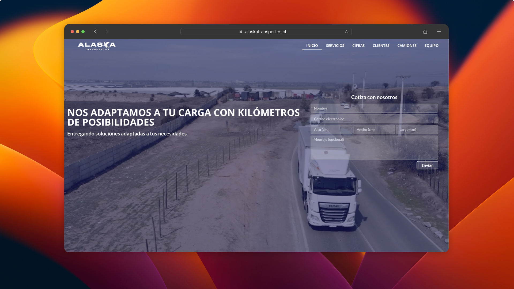

Website: [alaskatransportes](https://alaskatransportes.cl)

<h3 align="left">Languages and Tools:</h3>

        

